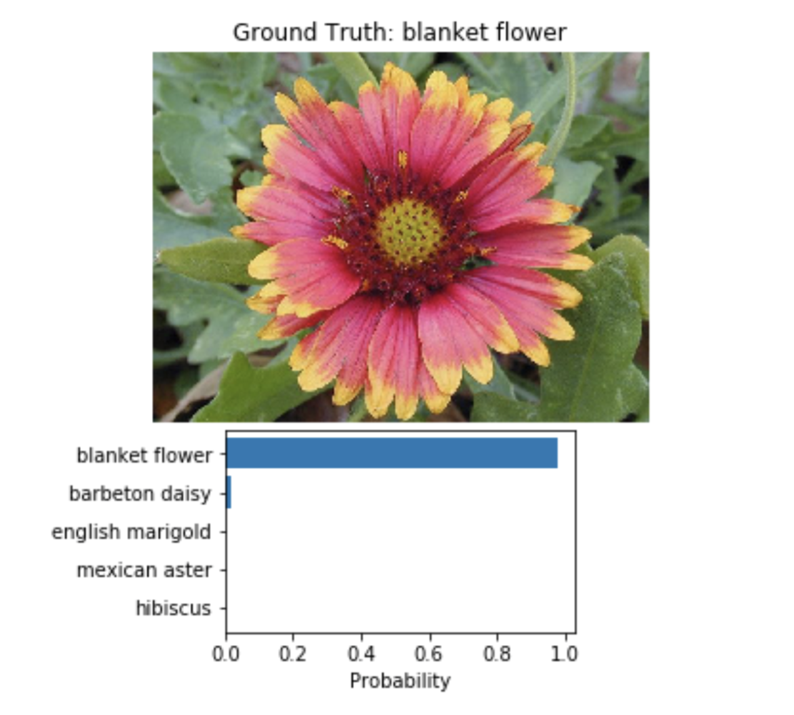

# Image classifier using Pytorch transfer learning models VGG13 and Alexnet # 

## Overview:

An AI algorithms will be incorporated into more and more everyday applications. For example, one might want to include an image classifier in a smart phone app. To do this, deep learning model can be trained on hundreds of thousands of images as part of the overall application architecture. A large part of software development in the future will be using these types of models as common parts of applications.

In this project, I will train an image classifier to recognize different species of flowers. I will train this classifier using PyTorch, then export it for use in application using the command line. We'll be using this dataset of 102 flower categories, you can see a few examples below.

The project is broken down into multiple steps:   

Load and preprocess the image dataset 
Train the image classifier on your dataset 
Use the trained classifier to predict image content 

## Directions: 

Use a trained network to predict the class for an input image from the command line.  

2 arguments must be entered: <path to the image> and <path to the trained model>  

Input format:
python predict.py <path to image> <path to model> --category_names <dictionary> --top_k <int>  

example input: python predict.py flowers/test/100/image_07896.jpg  checkpoint_alexnet.pth --top_k 3 --gpu  
  
## Please follow the notebook before you run the code in command line  

